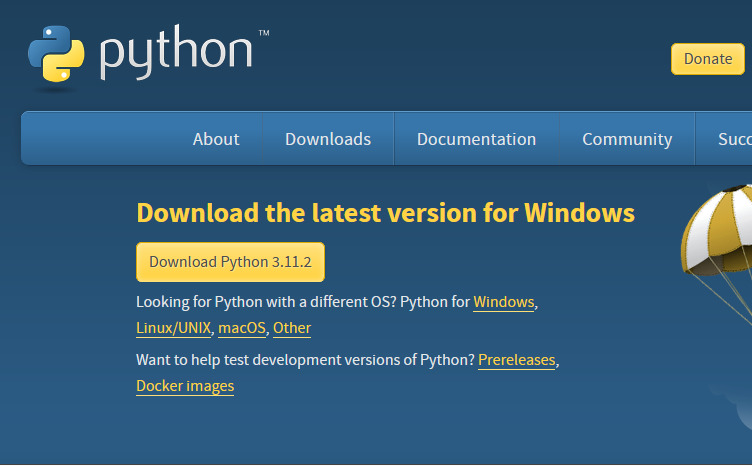
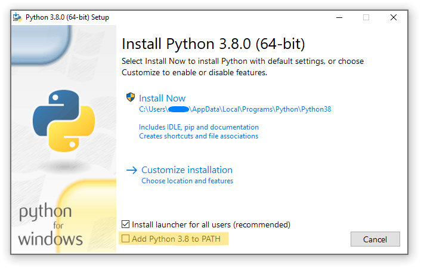

# Android Bloatware Cleaner

> **to remove those non-uninstallable apps that cover your stunning home screen wallpaper of your low spec old phone**

- - -

## Table Of Contents

1. [Introduction](#what-is-android-bloatware-remover)
1. [How to Use](#how-to-use)
1. [Limitations](#limitations)
1. [Contribute](#contribute)
1. [BackStory](#backstory)
- - -

## What is Android Bloatware Remover

**Bloatware** refers to those apps/softwares or services that comes preinstalled on a device and have no use to the user. These apps slow down the device and are impossible to remove by the end-user. **Ex -** Third-party browsers, app markets, payment apps, cloud services, mail services, accessibilities. This project is a python-based app which can remove all those storage taking apps and services by turning on USB-debugging on your phone and connecting via a USB-cable.

This project uses `tkinter` module to create a **GUI** (Graphical User Interface). **ADB** (Android Debug Bridge) binary is used to connect to the android shell through a USB-cable and get access to the **PM** (Package Manager). **AAPT** (Android Asset Packagaing Tool) binary is then injected into a temporary root folder of the phone which then collects data about all the packages available on the device and sends back to the PC. All those packages are then listed alongside a checkbox. Unwanted apps can then be easily searched and checked. After clicking the `Clean` button, respected packages will be removed in a snap. It must be noted that removed apps/services can be restored either by manually installing it from digital markets or resetting your phone. After the closing of this app, the injected tool will automatically be deleted from the phone.

- - -

## How to Use

1. ***Download Python*** from its official [website](https://www.python.org/downloads/).

and make sure that it is added to *PATH* while installation.

2. ***Clone this project*** to your local machine.

or download in *ZIP* format.

3. ***Turn on USB-debugging*** on your phone by following simple steps from [here](https://developer.android.com/studio/debug/dev-options)

4. ***Connect the android device with the PC*** via a USB-cable and allow dubugging permissions when prompted on the android device.

5. ***Open the `main.py`*** and wait until the app collects data and opens the GUI.

6. Rest is ***intuitive***.

- - -

## Limitations

1. Won't work on Samsung mobile devices protected by Knox Security.

1. Delay in doing the 4th step of [How-To-Use](#how-to-use) will require restart of the app.

- - -

## Contribute

This project has coming plans of adding new features such as *Search Option*, *Wireless Connectivity* and *Recoverability*. People would be highly appreciated for their contributions to grow this project.

----------------------------------------

## BackStory

**Hey Readers!** Thanks for using this application. This project came out into existence out-of-need. I wasn't given any personal mobile until high school graduation. Before that, I found the old phone in our store room, which my parents discarded years ago.
So, I started taking care of it, but it was very slow. So, I tried to find ways to remove its bloatware, but couldn't find a software to do that. So I made my own.

> ❤️‍🔥 Made with passion and love ❤️‍🔥